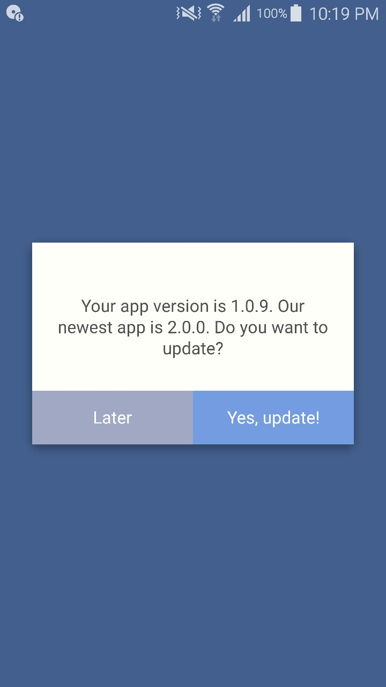

# Fuse Webview App
🚀Ship your website as Android/iOS app.

All the things you need to create a basic webview using ⚡️[fusetools](https://fuse-open.github.io).

-------------------------------------

## 📷 Screenshots




-------------------------------------

## ✔️ App Features 
- Back to previous page on back button
- Open BaseURL in webview if user navigate to about:blank
- Open native app when user click on a URL (if different host)
- Check app newest version on app startup
- [WIP] Exit app modal

-------------------------------------

## ❌ App Limitation
- If share to whatsapp/email, sometimes opens a web page instead of installed native app
- In android cannot exit application

-------------------------------------

## 🔧 How to Setup
1. Install FuseOpen

    Download and install fuseopen from https://fuse-open.github.io

2. Install Fuse Preview

    Fuse is equipped with FusePreview app, to help developer preview the modification in realtime right in their device.
    - Android : https://play.google.com/store/apps/details?id=com.fusetools.fusepreview 
    - iOS : https://itunes.apple.com/no/app/fuse-preview/id1296280076?mt=8


3. Install android SDK

    Android SDK is needed if you want to build your fuse into .apk file. You can install Android SDK using CLI,  
    ```
    fuse install android
    ```

4. Development

    Open the project with FuseStudio to modify and preview the app during development. Please note that webview only running on device, it doesn't run on FuseStudio. 

5. Configure app colors 

    All the colors variable used in the app are stored in the `/src/Resources.ux`  
    ```xml
    <Panel ux:Class="ColorResources">
      <float4 ux:Global="ColorMain"       		ux:Value="#445f8e"/>
      <float4 ux:Global="ColorButton"     		ux:Value="#759de3"/>
      <float4 ux:Global="ColorButtonDisable"	ux:Value="#a2a8c4"/>
      <float4 ux:Global="ColorBackground" 		ux:Value="#FFFFFF"/>
      <float4 ux:Global="ColorDark"       		ux:Value="#313131"/>
    </Panel>

    ```
6. App version checking
    
    App version checking works by comparing string from your fuse project located in `/src/AppConfig.js` with .json file from your server on fuse app startup.
    
    Thus, you have to put any accessible .json file in your server/cloud (i.e : http://yoursite.com/json/app-info.json), it should contain `appVersion` attribute as latest version of app in the playstore/appstore 
    ```json
    {
      "appVersion": "2.0.0"
    }
    ```
7. App configuration

    Before build your app, you need to setup some information used by the app in `/src/AppConfig.js`
    ```js
    module.exports = {
      APP_OS: '', // your target app OS
      APP_VERSION: '', // current app version (i.e: 1.0.0)
      BASE_URL: '', // url of webview
      APP_INFO_JSON: '', // json file of latest app information
      PLAYSTORE_URL: '', // launch URL of your app in google play store, when user click update app
      APPSTORE_URL: '', // URL of your app in apple appstore, when user click update app
    }
    ```

8. Prepare your app icon

    Draw your appicon as .png file, the size is 192x192 px. Then upload the file to https://jgilfelt.github.io/AndroidAssetStudio/icons-launcher.html to generate android icon. Put the output in `/src/assets/`. Then set the value for each icon in the .unoproj file
    ```
    "Android": {
      "Icons": {
        "LDPI": "src/assets/drawable-mdpi/ic_launcher.png",
        "MDPI": "src/assets/drawable-mdpi/ic_launcher.png",
        "HDPI": "src/assets/drawable-hdpi/ic_launcher.png",
        "XHDPI": "src/assets/drawable-xhdpi/ic_launcher.png",
        "XXHDPI": "src/assets/drawable-xxhdpi/ic_launcher.png",
        "XXXHDPI": "src/assets/drawable-xxxhdpi/ic_launcher.png"
      }
    }
    ```


9. Build for production

    Build your app for production release, following this step https://fuse-open.github.io/docs/basics/preview-and-export.html
    ```
    fuse build --target=Android --configuration=Release
    ```

10. Grab the .apk file
    
    Grab the output .apk file in the `build\Android\Release\[unoproj_name].apk`

-------------------------------------

## 😎 Note for developer
- Module not found if require js using relative path. I dont know why. Thus, I use require js using absolute path in all js.
- Resource Color doesn't applied on builded app if using `<ux:Resources>`, thus using `<Panel ux:Class="">` instead.

-------------------------------------

## 📃 References
- Go back in webview 
  https://forums.fusetools.com/t/navigation-in-webview/1173/4
- APK signer and keystore generator https://shatter-box.com/knowledgebase/android-apk-signing-tool-apk-signer/
- If error code is contains "A problem occurred evaluating project ':app'.", then please install android NDK. https://forums.fusetools.com/t/cant-preview-or-export-to-android/4125/20?u=superpikar 

  ```
  fuse install android
  ``` 
- In the WebView, open link as new tab / native app https://keypoint.ro/blog/post/opening-webview-links-native-browser 
